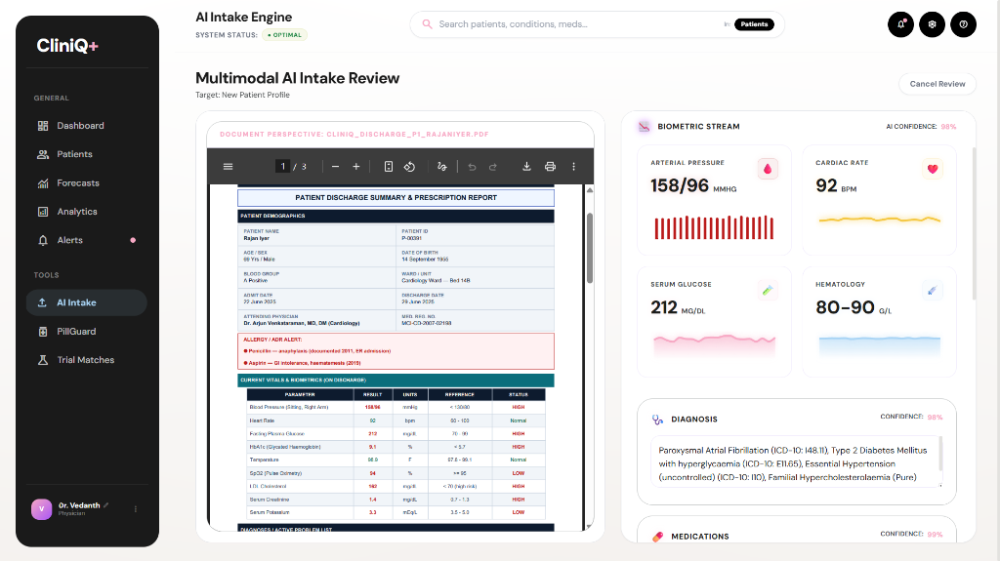
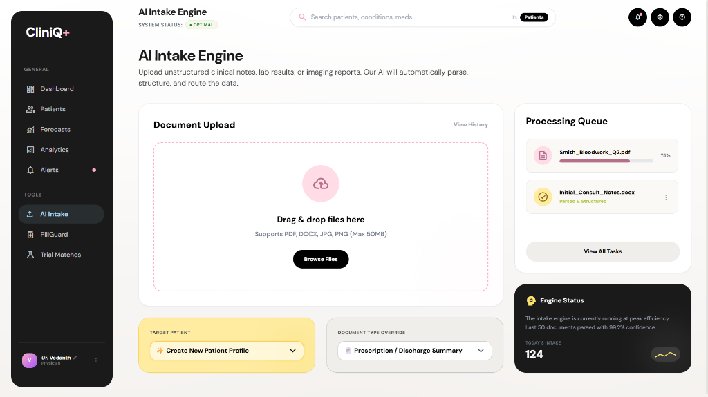
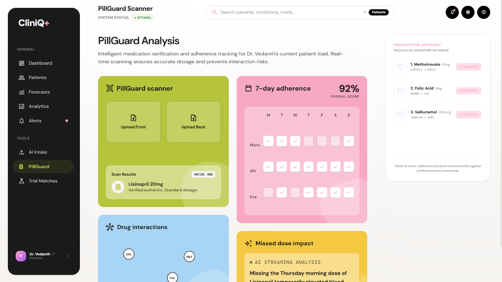
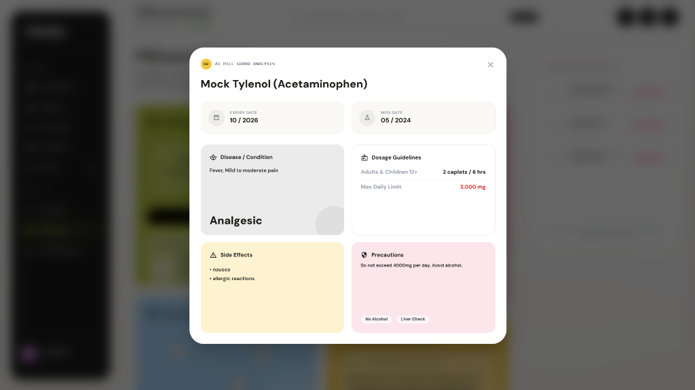
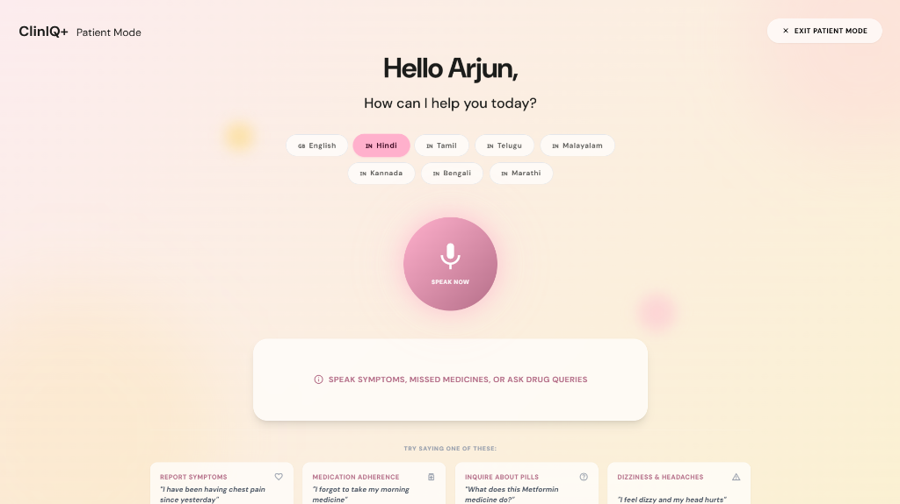

# 🏥 ClinIQ+ Clinical Intelligence Platform

[](https://vercel.com)
[](https://render.com)
[](https://vitejs.dev)
[](https://fastapi.tiangolo.com)
[](https://deepmind.google/technologies/gemini/)

ClinIQ+ is an advanced, AI-powered physician co-pilot and clinical decision support system. It integrates intelligent medical document processing, PillGuard safety analysis, patient voice assistant in local Indian languages, clinical trial eligibility screening, and interactive comorbidity visualizations to empower doctors and improve patient adherence.

---

## 🚀 Key Features

### 1. Multimodal AI Intake Engine
Instantly parse unstructured clinical notes, discharge summaries, and lab reports (PDF/Images) into structured patient profiles. The intake agent automatically extracts and streams patient demographics, vital signs, primary diagnoses, and medication regimens.

| Document Upload | Structured AI Review |
| :---: | :---: |
|  |  |

---

### 2. PillGuard Scanner & Adherence Tracker
Verify patient medication, track compliance, and prevent adverse events using vision AI.
* **Adherence Logs**: A 7-day morning/afternoon/evening schedule tracking compliance.
* **Drug Interaction Graph**: Real-time visual graphing of active medications and identified contraindications.
* **Missed Dose Impact**: SSE-streamed clinical risk profile calculations for missed medication.
* **Mock Tylenol Scanner**: Dialog showcasing active ingredients, dosage rules, and drug side-effects.

| PillGuard Dashboard | AI Ingredient & Adherence Analysis |
| :---: | :---: |
|  |  |

---

### 3. Patient Voice Assistant (Multilingual)
A multilingual voice assistant built for patients to speak symptoms, check drug queries, or log missed doses in their local language. Supports 7 Indian languages: **Hindi, Tamil, Telugu, Malayalam, Kannada, Bengali, and Marathi**, with real-time audio playback reassurance.

<p align="center">
  
</p>

---

### 4. Advanced Clinical Features
* **Clinical Trial Matcher**: Match patients automatically against database trials using Gemini AI to evaluate complex eligibility (inclusion/exclusion) parameters.
* **Comorbidity Network Graph**: Dynamic interactive network web of patient health conditions, showing risk levels and condition links.
* **Professional PDF Case Sheet Export**: Download beautifully formatted PDF clinical summary sheets directly from the patient profile page.

---

## 🛠️ Technology Stack

### Frontend
* **Core**: React 19, React Router, Vite, Zustand (State Management)
* **Styling**: Vanilla CSS + TailwindCSS, Glassmorphism, Responsive Bento Grids
* **Visualizations**: D3.js, Recharts, Three.js (3D Assets), GSAP (Micro-animations)
* **Integration**: Capacitor (Android/Mobile builds ready)

### Backend
* **Core**: FastAPI (Python), SQLite (Patient & Config database)
* **AI & LLM**: Google GenAI SDK (`gemini-2.5-flash`)
* **Utilities**: SSE (Server-Sent Events) streaming, ReportLab (PDF generator), Matplotlib (clinical forecasting charts)

---

## ⚙️ Setup & Installation

### Prerequisites
* Node.js (v18+)
* Python 3.10+
* Gemini API Key

### Backend Setup (FastAPI)
1. Navigate to the backend folder:
   ```bash
   cd cliniq-backend
   ```
2. Create a `.env` file and specify your Gemini key:
   ```env
   GEMINI_API_KEY=your_gemini_api_key_here
   ```
3. Install dependencies:
   ```bash
   pip install -r requirements.txt
   ```
4. Run the development backend:
   ```bash
   python main.py
   ```
   *The API will run on http://localhost:8000*

### Frontend Setup (React + Vite)
1. Go to the project root and install Node modules:
   ```bash
   npm install
   ```
2. Start the Vite development server:
   ```bash
   npm run dev
   ```
   *The client will run on http://localhost:5173*

---

## 🤖 AI Agent Architecture
ClinIQ+ uses specific specialized agents powered by Gemini function calling to run clinical tasks:
1. **Intake Agent (`intake_agent.py`)**: Extract and structure patient clinical metrics from documents.
2. **Pill Agent (`pill_agent.py`, `pill_analyzer_agent.py`)**: Analyze pill images, identify chemicals, and calculate drug-drug interactions.
3. **Voice Query Agent (`voice_query_agent.py`)**: Parse multilingual voice inputs, categorize medical complaints, and return localized audio reassurance.
4. **Trial Matcher Agent (`trial_matcher_agent.py`)**: Compare structured patient case records against clinical trial protocols.

---

## 👥 Authors & Teammates
* **Dr. Vedanth** - Lead Clinical AI Developer & System Architect
* **Keerthivasa** - Senior Backend Engineer
