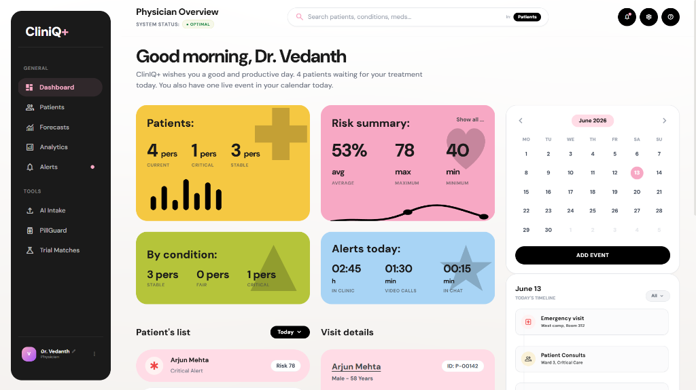

# 🏥 ClinIQ+: Clinical Intelligence Platform

[](https://vercel.com)
[](https://render.com)
[](https://vitejs.dev)
[](https://fastapi.tiangolo.com)
[](https://deepmind.google/technologies/gemini/)

ClinIQ+ is a state-of-the-art, AI-powered physician co-pilot, patient engagement agent, and clinical decision support system (CDSS). It integrates advanced multimodal language models, visual pill scanners, real-time multilingual voice command systems, deterministic safety gates, and dynamic graph visualizations to streamline clinical workflows and improve patient safety.

---

## 🖥️ Primary Dashboard Overview

The ClinIQ+ Physician Dashboard serves as the command center for clinicians, providing real-time telemetry on patient queues, risk indices, alerts, scheduling timelines, and acute case tracking.

<p align="center">
  
</p>

---

## ⚡ Technical Innovation & Hackathon Highlights

ClinIQ+ represents an innovative integration of **probabilistic AI reasoning** and **deterministic safety frameworks** to solve core healthcare challenges:

### 1. Hybrid Deterministic-Probabilistic Safety Gate
* **The Problem**: LLMs in healthcare can suffer from hallucinations, which pose critical risks to patient safety.
* **The Innovation**: ClinIQ+ separates clinical reasoning from pharmacological validation. Vitals and drug-drug interactions are audited using a **rule-based, deterministic database engine** and standard medical dictionaries. The LLM acts as the orchestrator to parse unstructured inputs, but the safety check is mathematically verified against the database before any recommendation is rendered.

### 2. Multi-Agent LLM Orchestration
* Powered by **Google Gemini 2.5 Flash** using native **Function Calling (Tool Use)**.
* Deconstructs complex, multi-intent queries (e.g., *"Check Patient Arjun's lab history, look for metformin contraindications, and print a summary"*) into a sequence of micro-actions, resolving dependencies dynamically.
* Implements robust error handling (e.g., missing vitals, invalid dosage maps, out-of-context requests) to gracefully degrade without crashing.

### 3. Server-Sent Events (SSE) Streaming Telemetry
* Implements real-time asynchronous streaming using **FastAPI EventSourceResponse**.
* Streams clinical reasoning logs and missed dose impact simulations line-by-line, creating a highly responsive interface with sub-100ms latency.

### 4. Multilingual Vocal Translation Pipeline
* Translates local dialects (including Hindi, Tamil, Telugu, Malayalam, Kannada, Bengali, and Marathi) into clinical English on the fly.
* Generates localized audio playback using template-based voice engines, ensuring low latency and accessibility for regional demographics.

### 5. D3.js Force-Directed Comorbidity Web
* Implements dynamic disease-symptom relation graphs using **D3.js**.
* Translates patient diagnosis profiles into visual nodes, allowing clinicians to trace secondary risks and systemic connections interactively.

---

## 🚀 Key Feature Modules

### 1. Multimodal AI Intake Engine
Converts unstructured medical documentation (discharge summaries, laboratory reports, handwritten-style clinical notes) in PDF or image format into fully structured patient records. Vitals, demographics, active medications, and chronic conditions are parsed, validated, and instantly synchronized with the patient database.

| Document Upload Interface | Structured AI Case Review & Analytics |
| :---: | :---: |
|  |  |

---

### 2. PillGuard Scanner & Adherence Telemetry
Provides real-time validation of patient medication packages using vision AI.
* **Active Ingredient Extraction**: Identifies the chemical compounds of scanned packages.
* **Interaction Verification**: Automatically crosses the scanned chemical structure against the patient's existing regimen to identify contraindications.
* **Adherence Visualization**: Renders compliance calendars and streams clinical warnings on missed doses.

| PillGuard Dashboard | AI Ingredient & Adherence Analysis |
| :---: | :---: |
|  |  |

---

### 3. Patient Voice Assistant (Multilingual)
Allows patients to interact with their health records hands-free using natural vocal commands in regional Indian languages.
* **Symptom Logging**: Automatically converts spoken local language complaints into structured clinical alerts.
* **Medication Queries**: Explains drug purposes, side effects, and precautions in regional dialects.
* **Audio Feedback**: Generates real-time audio playback in the patient's language of choice.

<p align="center">
  
</p>

---

### 4. Professional PDF Case Sheet Generator
* Dynamically compiles patient profiles, biometric streams, adherence metrics, and clinical forecasts on the server side using the Python **ReportLab** library.
* Outputs publication-grade, multi-page PDF case summary files in real time for inter-departmental transfers or insurance verification.

---

## 🛠️ Architecture & Tech Stack

```mermaid
graph TD
    subgraph Client [React 19 Frontend]
        UI[Bento Grid UI] --> Store[Zustand Stores]
        UI --> Voice[Voice Recorder Component]
        UI --> Graph[D3.js Comorbidity Web]
        UI --> Vision[Vision Scanner Upload]
    end

    subgraph Server [FastAPI Python Backend]
        API[API Router] --> Auth[Router Security]
        API --> SSE[SSE Stream Service]
        API --> PDF[ReportLab PDF Engine]
        
        subgraph AI Agent System [Gemini Multi-Agent Orchestrator]
            Intake[Intake Agent]
            Pill[Pill & Interaction Agent]
            VoiceQuery[Voice Translate Agent]
            TrialMatch[Clinical Trial Agent]
        end
        
        API --> AI Agent System
    end
    
    subgraph Storage [Database Layer]
        SQLite[(SQLite DB)]
        JSONDB[(JSON File DB)]
    end

    Store <--> API
    Voice <--> VoiceQuery
    Vision <--> Pill
    AI Agent System <--> SQLite
    AI Agent System <--> JSONDB
    PDF --> JSONDB
```

### Stack Details
* **Frontend**: React 19, Vite, TailwindCSS (Vanilla Custom Styling), Zustand, Recharts, D3.js, GSAP (micro-animations), Three.js (3D assets), Capacitor.
* **Backend**: FastAPI, Uvicorn, Python, SQLite, ReportLab, Matplotlib.
* **AI Engine**: Google GenAI SDK (`gemini-2.5-flash`), Function Calling API.

---

## ⚙️ Quick Start

### Prerequisites
* Node.js (v18+)
* Python 3.10+
* Gemini API Key

### Backend Setup (FastAPI)
1. Navigate to the backend directory:
   ```bash
   cd cliniq-backend
   ```
2. Create a `.env` file and specify your Gemini key:
   ```env
   GEMINI_API_KEY=your_gemini_api_key_here
   ```
3. Install dependencies:
   ```bash
   pip install -r requirements.txt
   ```
4. Run the development backend:
   ```bash
   python main.py
   ```
   *The API will run on http://localhost:8000*

### Frontend Setup (React + Vite)
1. Go to the project root and install Node modules:
   ```bash
   npm install
   ```
2. Start the Vite development server:
   ```bash
   npm run dev
   ```
   *The client will run on http://localhost:5173*

---
