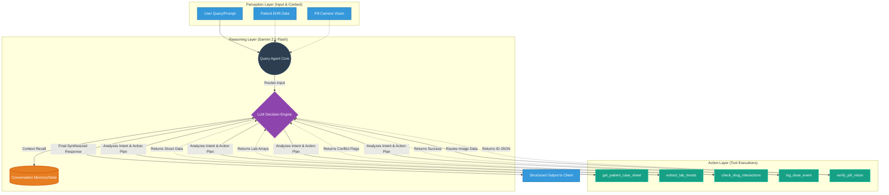

# Agent Architecture Diagram

```mermaid
graph TD
    %% Define Styles
    classDef agent fill:#2C3E50,stroke:#34495E,stroke-width:2px,color:#ECF0F1
    classDef llm fill:#8E44AD,stroke:#9B59B6,stroke-width:2px,color:#FFFFFF
    classDef memory fill:#E67E22,stroke:#D35400,stroke-width:2px,color:#FFFFFF
    classDef tools fill:#16A085,stroke:#1ABC9C,stroke-width:2px,color:#FFFFFF
    classDef inputs fill:#3498DB,stroke:#2980B9,stroke-width:2px,color:#FFFFFF

    %% Perception Layer
    subgraph Perception Layer ["Perception Layer (Input & Context)"]
        A[User Query/Prompt]:::inputs
        B[Patient EHR Data]:::inputs
        C[Pill Camera Vision]:::inputs
    end

    %% Reasoning Layer
    subgraph Reasoning Layer ["Reasoning Layer (Gemini 2.5 Flash)"]
        D((Query Agent Core)):::agent
        E{LLM Decision Engine}:::llm
        F[(Conversation Memory/State)]:::memory
        D -->|Routes Input| E
        E <-->|Context Recall| F
    end

    %% Action Layer
    subgraph Action Layer ["Action Layer (Tool Executions)"]
        G[get_patient_case_sheet]:::tools
        H[extract_lab_trends]:::tools
        I[check_drug_interactions]:::tools
        J[log_dose_event]:::tools
        K[verify_pill_vision]:::tools
    end

    %% Flow Dynamics
    A --> D
    B -.-> D
    C -.-> D
    
    E -->|Analyzes Intent & Action Plan| G
    E -->|Analyzes Intent & Action Plan| H
    E -->|Analyzes Intent & Action Plan| I
    E -->|Analyzes Intent & Action Plan| J
    E -->|Routes Image Data| K

    G -.->|Returns Struct Data| E
    H -.->|Returns Lab Arrays| E
    I -.->|Returns Conflict Flags| E
    J -.->|Returns Success| E
    K -.->|Returns ID JSON| E

    E -->|Final Synthesized Response| L[Structured Output to Client]:::inputs
```
